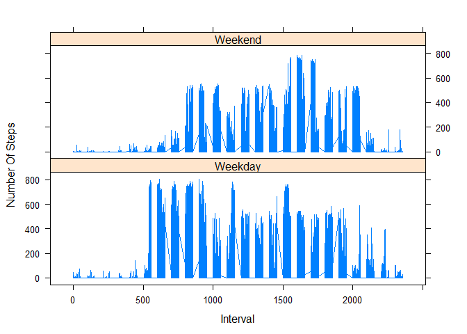

# Reproducible Research: Peer Assessment 1


## Loading and preprocessing the data
The following code loads the activity data

```r
activity <- read.csv("activity.csv", header = TRUE, sep = ",")
activity$date <- as.Date(activity$date)
```

## What is mean total number of steps taken per day?
The following code calculates and plots a histogram of the total number of steps taken each day.

```r
library(ggplot2)
```

```
## Warning: package 'ggplot2' was built under R version 3.1.3
```

```r
numOfStepsPerDay <- aggregate(activity$steps, by = list(activity$date), FUN = sum, na.rm = TRUE)
names(numOfStepsPerDay) <- c("Day", "Total_Steps")
qplot(numOfStepsPerDay$Total_Steps, data = numOfStepsPerDay, binwidth = 2000, 
      xlab = "Total Steps per day", main = "Histogram of total number of steps taken each day")
```

 

The mean and the median total number of steps taken per day are,

```r
mean(numOfStepsPerDay$Total_Steps, na.rm = TRUE)
```

```
## [1] 9354.23
```

```r
median(numOfStepsPerDay$Total_Steps, na.rm = TRUE)
```

```
## [1] 10395
```

## What is the average daily activity pattern?
The followig code plots the interval with the average number of steps taken, averaged across all days

```r
avgSteps <- aggregate(activity$steps, by = list(activity$interval), FUN = mean, na.rm = TRUE)
names(avgSteps) <- c("interval", "Avg_Steps")
qplot(avgSteps$interval, avgSteps$Avg_Steps, main = "Average daily activity pattern",
      xlab = "Interval", ylab = "Steps")+geom_line()
```

 

The following 5-minute interval, on average across all the days in the dataset, contains the maximum number of steps

```r
avgSteps[which.max(avgSteps$Avg_Steps),c("interval")]
```

```
## [1] 835
```

## Imputing missing values

Total number of missing values in the dataset is,

```r
sum(is.na(activity))
```

```
## [1] 2304
```

The following strategy fills the missing values by the mean number of steps for that interval. We merge the 
original dataset with an object that has the mean number of steps for an interval. We then replace all the 
missing fields with the mean value of that interval.

```r
temp <- merge(activity, avgSteps, by = "interval", all.x = TRUE)
naPositions <- is.na(temp$steps)
temp$steps[naPositions] <- temp$Avg_Steps[naPositions]
```

Creating a new dataset with the missing values filled.

```r
activity <- temp[,c(1:3)]
```

After replacing NAs with the mean values, the new histogram of the total number of steps taken each day 
is calculated below. Also the mean and median total number of steps taken each day is also calculated below.

```r
numOfStepsPerDay <- aggregate(activity$steps, by = list(activity$date), FUN = sum)
names(numOfStepsPerDay) <- c("Day", "Total_Steps")
qplot(numOfStepsPerDay$Total_Steps, data = numOfStepsPerDay, binwidth = 2000, 
      xlab = "Total Steps per day", main = "Histogram of total number of steps taken each day")
```

 

```r
mean(numOfStepsPerDay$Total_Steps)
```

```
## [1] 10766.19
```

```r
median(numOfStepsPerDay$Total_Steps)
```

```
## [1] 10766.19
```

## Are there differences in activity patterns between weekdays and weekends?
The weekdays() function is used to differentiate the weekdays data and the weekend data.
A new factor variable is created with two levels -- weekday and weekend.
A new graph (panel plot) is plot for the 5-minute interval with the average number of steps taken averaged across all weekdays and weekends is created seperately for each case.


```r
activity$Day <- weekdays(activity$date)
activity$Day[which(activity$Day=="Sunday" | activity$Day=="Saturday")] <- c("Weekend")
activity$Day[which(activity$Day != "Weekend")] <- c("Weekday")
activity$Day <- as.factor(activity$Day)
avgAmongDays <- aggregate(activity$steps ~ activity$interval + activity$Day, data=activity, FUN=mean)
library(lattice)
xyplot(activity$steps ~ activity$interval | activity$Day, activity, type = "l", layout = c(1, 2), 
       xlab = "Interval", ylab = "Number Of Steps")
```

 
